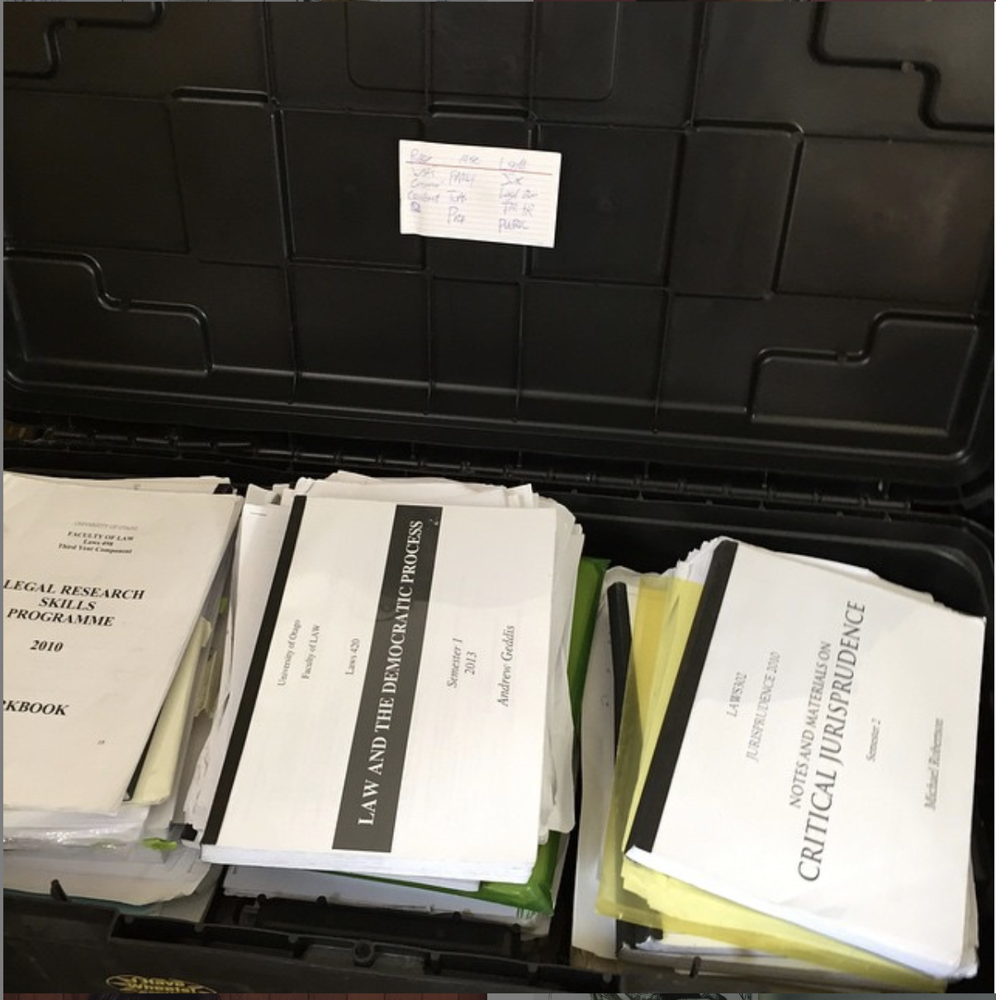
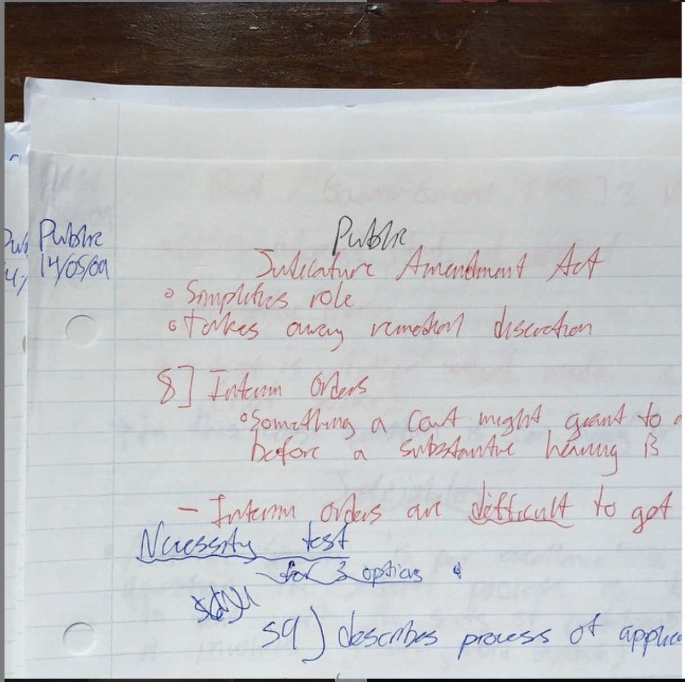

# Law (Love?) Notes

### Hobby side project to release into the creative commons a set of transcribed notes from havin done a law degree and do some analysis/remixing 

#### Ideas:

* Create Git Repository, in incredibly unlikely event these out of date notes would be useful to anyone. 

* License the project to be as permissive as possible - MIT?

* Perform `wc` on the notes. ✅

* Do something with machine learning with the notes (stretch goal)

* Create a `fortune` like Unix program or script that returns a fragment of the notes on command

## About the Notes

Transcribed from notes created 2009-2014 doing a law degree at Otago.

A huge portion of the notes are case citations without no surrounding context-  often just a note that I am to be aware and read portions of the case.

 Word count in .doc and .docx using Pages: <b>19,366 words</b>

#### WC Output:

	in	notes/transcribed on master▲
	$ wc *
     459   22556  393728 Law notes.doc
     832    5888  198030 Law notes.docx
    3526   21737  477315 Law notes.pdf
    4817   50181 1069073 total

### 

## About this repo:

* `transcribed/` contains the original transcribed notes delivered to me. Ill remix them in `analysis`

## About this project

 When I did my undergraduate Bachelors of Law degree (LLB) in New Zealand at Otago University I read an enormous amount over 5 years. I was assigned even more than I was able to finish: It is a pretty rigorous course as any graduate will tell you. Almost every course had a large printout of course materials. I have a collectors streak so I kept all my printouts and notes in a large plastic trunk well until after graduation into 2015:

It was a heavy large trunk of paper. At the time, I paid a good friend to help me transcribe all of my handwritten notes. I really appreciated it this since my handwriting is and was terrible. I couldn't continue to lug around the scribbled notes forever.

 Fast forward to 2020 and I haven't touched a law book since 2015 when I last studied for my Legal Professionals exam's (equivalent of the bar exam in New Zealand). Since then I have made a career change and worked a web developer for just under three years- but you can find all about that at [my website](morganwebdev.com).
 
 
 
## License 

TBD